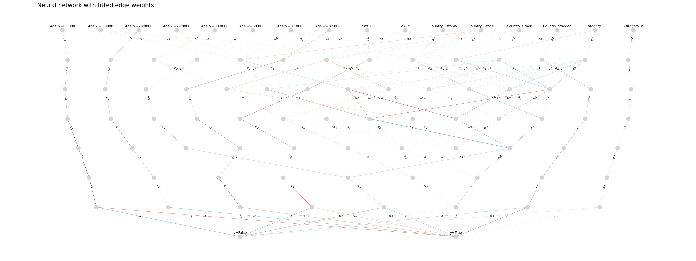
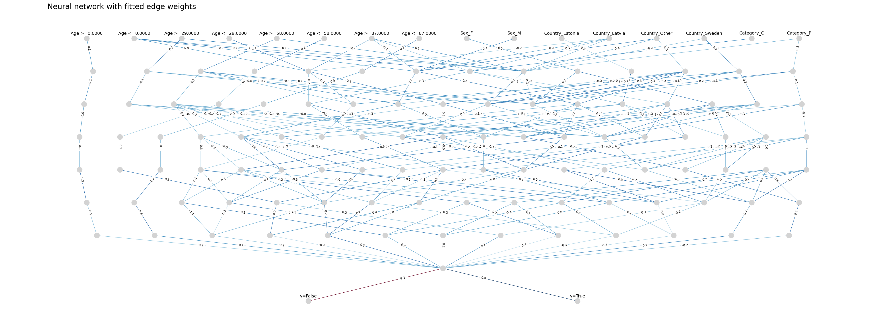
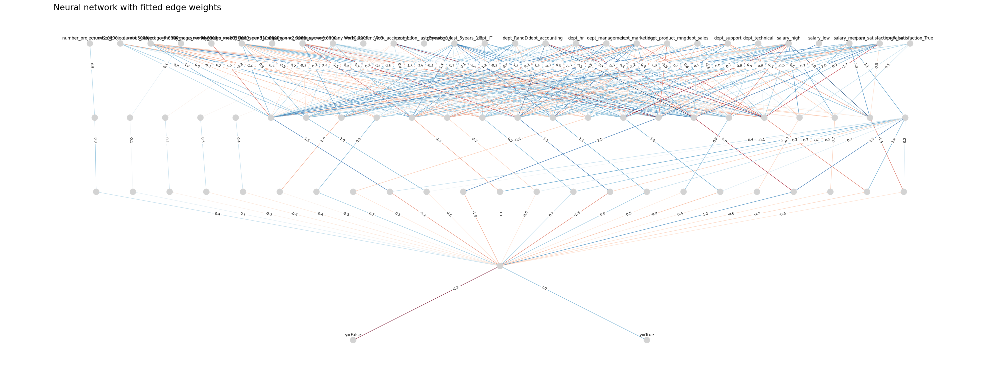
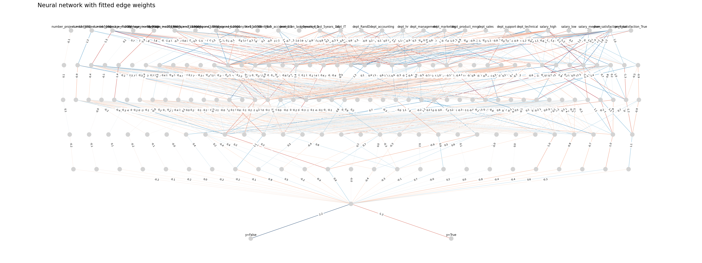
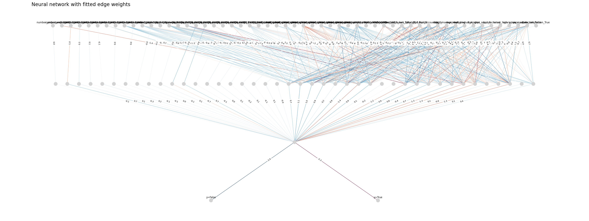
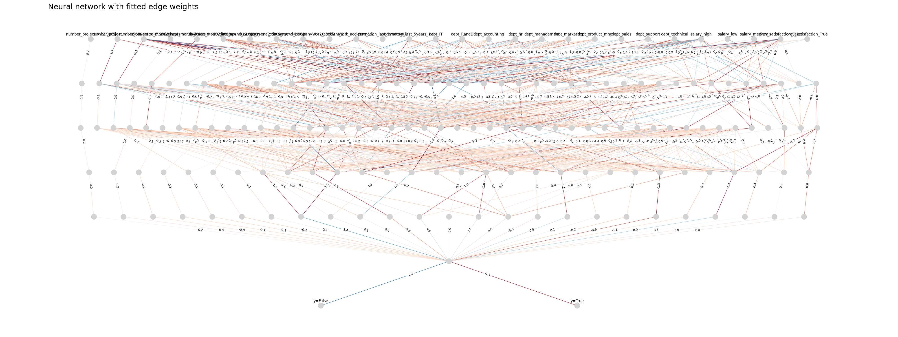

# Description

This is big homework for OSDA course made by Kirdin Matvei. Here I used Estonia Disaster Passenger List and Employee Attrition datasets. 

# Estonia Disaster Passenger List

This dataset small both in terms of number of features and objects, therefore poor perfomance is to be expected on this set. 

Now let's look at performance of several models on this dataset:

|                          Classifier                                      | $f_1$-score | accuracy |
| :----------------------------------------------------------------------- | ----------- | -------- |
| GaussianNB()                                                             |  0.363636   | 0.802419 |
| RandomForestClassifier(random_state=42)                                  |  0.230769   | 0.838710 |
| HistGradientBoostingClassifier(class_weight='balanced', random_state=42) |  0.326923   | 0.717742 |
| NeuralFCA(concepts_count=20)                                             |  0.000000   | 0.862903 |
| NeuralFCA(concepts_count=50)                                             |  0.000000   | 0.862903 |

It is apparent that neural network produced from the respective concept lattice tends to overfit due to insufficient data.

# Employee Attrition

Let's consider a more substantial dataset. The Employee Attrition dataset has 15K entries after dropping of all rows containing at least one empty value, hence it was decided to work only with a selection of 2400 randomly selected elements of this set. Let's see the NNs based on 20 and 50  best-performing formal concepts:

Now let's compare performances of several models along with NeuralFCA on this dataset:

|                          Classifier                                      | $f_1$-score | accuracy |
| :----------------------------------------------------------------------- | ----------- | -------- |
| GaussianNB()                                                             |  0.831797   | 0.756667 |
| RandomForestClassifier(random_state=42)                                  |  0.888889   | 0.838333 |
| HistGradientBoostingClassifier(class_weight='balanced', random_state=42) |  0.879147   | 0.830000 |
| NeuralFCA(concepts_count=20)                                             |  0.824295   | 0.730000 |
| NeuralFCA(concepts_count=50)                                             |  0.831915   | 0.736667 |

Let's see how interordinal encoding with increased number of intervals will affect performance of the network:

|                          Classifier                                      | $f_1$-score | accuracy |
| :----------------------------------------------------------------------- | ----------- | -------- |
| GaussianNB()                                                             |  0.831797   | 0.756667 |
| RandomForestClassifier(random_state=42)                                  |  0.888889   | 0.838333 |
| HistGradientBoostingClassifier(class_weight='balanced', random_state=42) |  0.879147   | 0.830000 |
| NeuralFCA(concepts_count=20)                                             |  0.867749   | 0.810000 |
| NeuralFCA(concepts_count=50)                                             |  0.876744   | 0.823333 |

# Conclusion

Neural networks based on concept lattices perform on par with several enseble models and show promise in some machine learning applications.